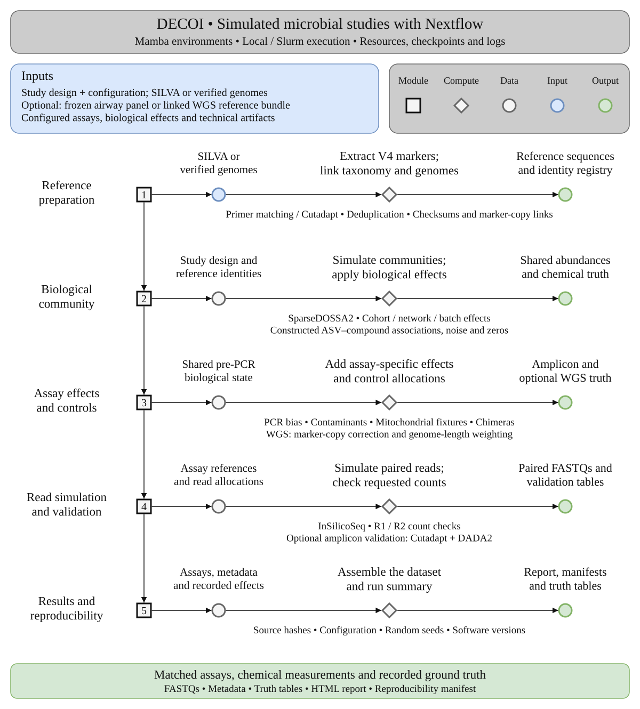

# DECOI: **D**ata **E**mulator for **C**ommunity **O**mics tool Benchmark**I**ng

DECOI generates truth-aware V4 16S amplicons, correlated chemistry and optional
matched short-read metagenomics from one mock microbial study. It records imposed
artifacts and sequence provenance for workflow and statistical-method testing.
The chemistry is correlated by construction, not a mechanistic metabolic model.

[Full user guide](https://hallamlab-decoi.readthedocs.io/en/latest/) ·
[Reviewer test](https://hallamlab-decoi.readthedocs.io/en/latest/reviewer-test.html) ·
[Issues and feature requests](https://github.com/hallamlab/DECOI/issues)



## Quick start

On Linux with mamba and Git available. For setup from a new machine, follow
the [complete installation guide](docs/installation.md). The command below selects
the current controller branch.

```bash
git clone --branch refactor/user-guide-installation https://github.com/hallamlab/DECOI.git
cd DECOI
mamba env create -f environment.yml
conda activate decoi
Rscript scripts/install_sparsedossa2.R
python -m pip install .
```

## Small test run

```bash
decoi check
decoi test -o test-output
decoi report -o test-output --serve
```

Open `http://localhost:8765/report.html`. The test requests one CPU and 4 GB RAM
and generates its tiny reference genomes locally. It exercises amplicon and WGS
reads, chemistry, extraction controls, and ground-truth tables.

For your own study:

```bash
decoi run --config study-config.yaml -o study-output --threads 8
```

The controller runs Nextflow and keeps logs and work files in the output directory.
Use `--resume` to reuse matching completed tasks. See the [command-line guide](docs/cli.md)
for input paths, resource controls and Slurm, and the [full user guide](docs/index.md)
for study design, reference preparation and interpretation. Matched WGS remains experimental.

## Citation

Cite the tools and references used in your run, listed in
[software and reference citations](docs/citations.md). A DECOI publication
citation has not yet been assigned.
