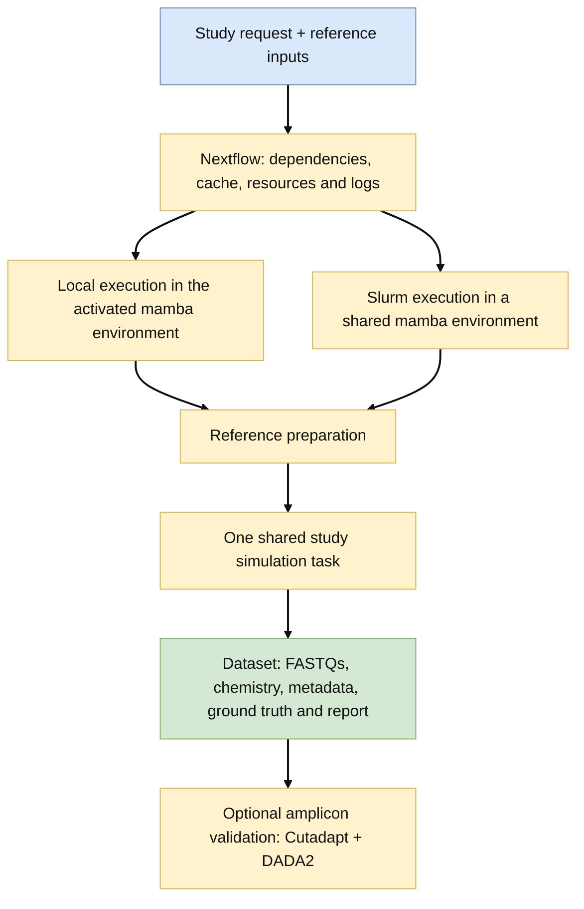
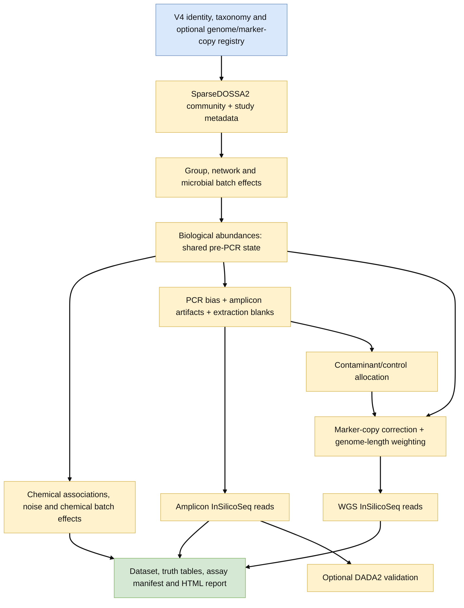

# Workflow, architecture and data flow

The diagrams describe the implemented software. Numbered modules show conceptual
progression; optional DADA2 is a downstream validation branch. Simulation of a
study is one Nextflow task containing the assay generation logic.

```{image} assets/workflow-main.svg
:alt: Detailed DECOI reference, biological state, assay artifacts, sequencing and output flow
```

## Execution architecture



`main.nf` prepares either SILVA-derived or genome-derived V4 references, simulates
the study, and optionally validates amplicons. Genome-first inputs are required
for sequence-verified shared genome linkage; a SILVA-derived run can also use an
explicit prelinked WGS reference bundle. The frozen airway panel is an optional
reference selection, not a prerequisite for the small reviewer test.

Use `--threads` to request the CPUs used by amplicon and WGS read simulation.
The simulation process reserves those CPUs in Nextflow. Reference preparation
uses one CPU; optional DADA2 has a separate `--dada2_threads` request. Local
execution is the default. `-profile slurm` uses Slurm; use a site configuration
file for account, partition and task resource limits. This is not currently a
per-sample distributed simulation DAG: multiple samples are generated inside
one simulation task. Compute nodes must see the environment and work directory.

## Scientific data flow



Amplicon PCR and chimera effects do not rewrite the shared biological state used
for chemistry and WGS. WGS excludes amplicon-only chimeras and mitochondrial
marker fixtures. Marker copy numbers and genome sizes distinguish genome-copy
and DNA-weighted truth from amplicon read proportions. Interpret these tables
at the correct stage rather than comparing all assays to the final amplicon counts.

See [ground-truth table definitions](outputs.md), [paired WGS](wgs.md),
[reproducibility and limits](reproducibility.md), and the
[software/reference citations](citations.md) for the tools shown here.
